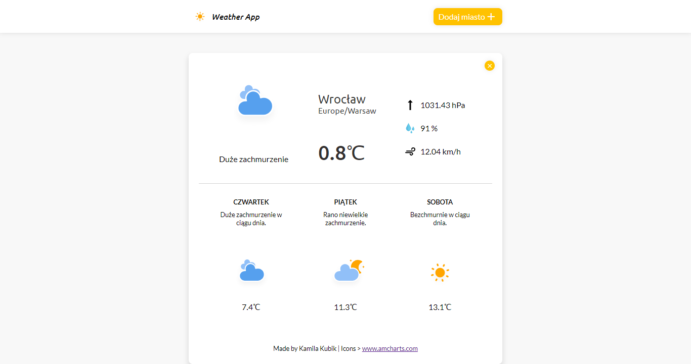
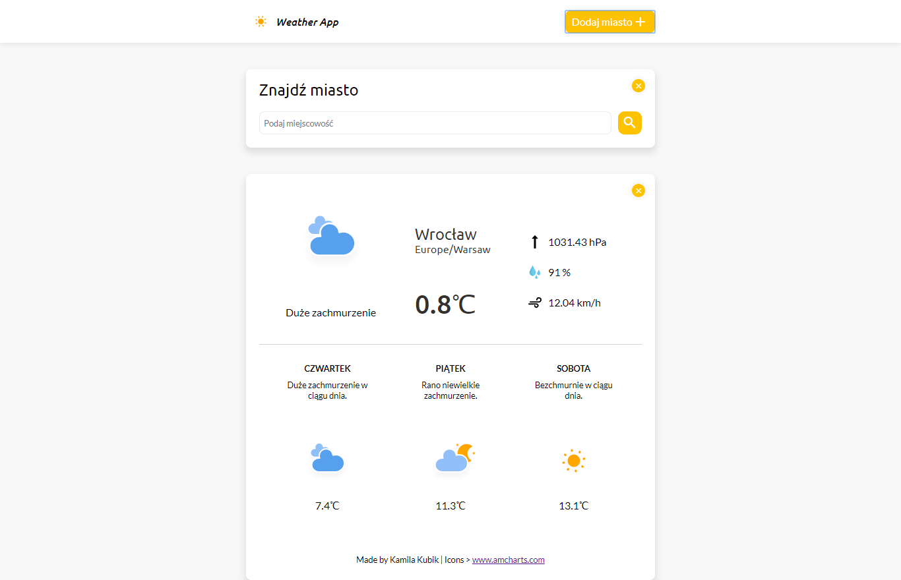
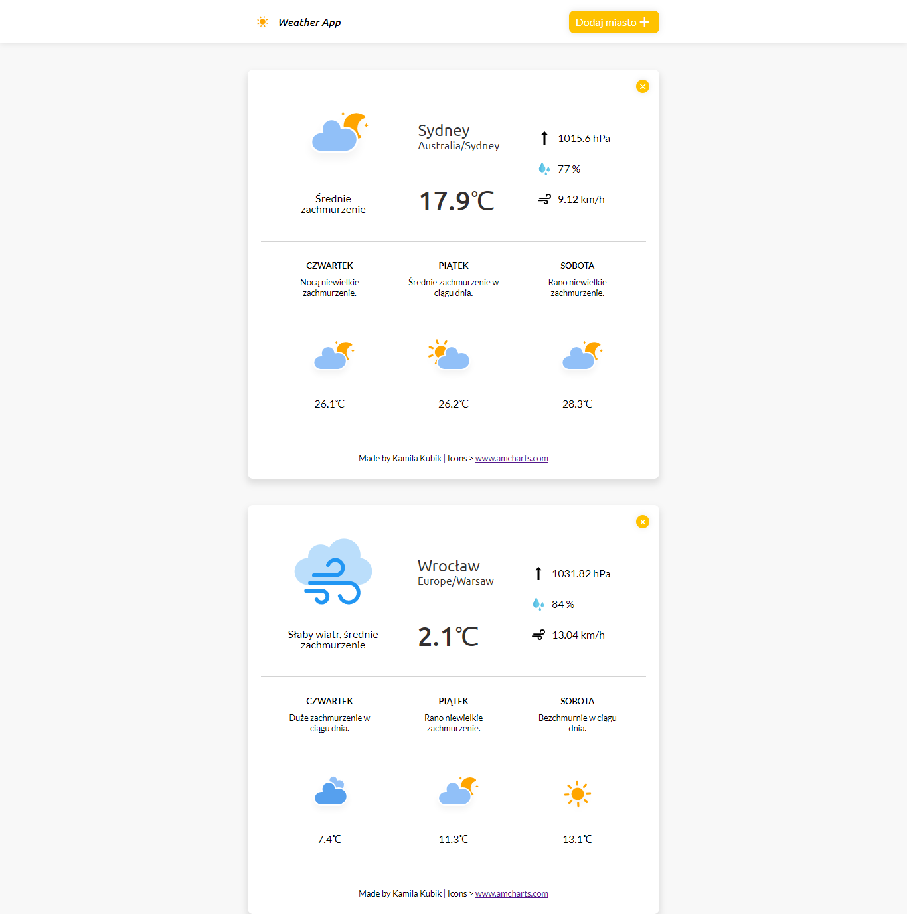

# Weather App - JavaScript
My project "Weather App - JavaScript" was created during Coders Lab course. This is next step in my portfolio.
 

## Used technologies
I used HTML, SCSS, RWD, JavaScript, jQuery, AJAX and external API: https://ipapi.co/json/ | https://graphhopper.com | https://darksky.net/dev 

## Usage
To start using this app click [here](https://kubikweb.github.io/Weather_App_JavaScript/).
 
## About
Weather App shows you current temperature, wind speed, pressure, humidity, special icons and the
weather forecast for next three days of the city that you enter in searching area. The first screen shows you current weather based on your IP address.

First Screen


Searching area


Result of searching


See you next time!

```javascript
	var author = "Kamila Kubik";
	var position = "junior frontend developer";
	alert('${author} - ${position}, 13/02/2019');
```

